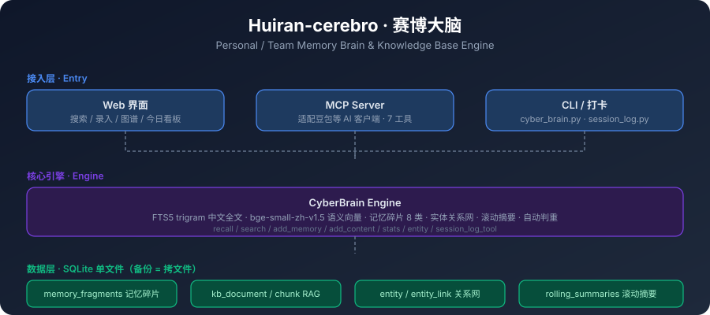

# Huiran-cerebro · 赛博大脑

<p align="center">
  
</p>

<p align="center">
  
  
  
  
  
  
  
</p>

个人/团队记忆中枢与知识库引擎。单文件 SQLite，零服务依赖，融合「知识库 RAG + 记忆碎片 + 实体关系 + AI 检索」四层能力，可作 AI 助手的外接记忆（支持 MCP，已适配豆包等客户端）。

> **一句话**：把 AI 的「记忆」和「知识」沉淀成本地可检索、可对话的私有知识库。

<!-- AI-README：以下为给 AI 爬虫/LLM 的结构化摘要，便于快速理解项目 -->
<details open>
<summary><b>📋 AI 快速摘要（给 LLM 阅读）</b></summary>

- **这是什么**：个人/团队记忆中枢 + 知识库引擎，单文件 SQLite 零依赖，可作 AI 助手（Agent）的外接记忆层（Memory Layer）
- **解决什么问题**：①AI 会话记忆断片（上午做下午忘）②个人/团队知识分散难检索 ③中文检索效果差 ④记忆随体量膨胀而遗忘（长期记忆 / Long-Term Memory）
- **核心能力**：FTS5 trigram 中文全文检索 · bge-small-zh-v1.5 本地语义向量 · **RRF 多信号混合检索（FTS+LIKE+实体+语义四路融合）** · **时间感知检索（recall --days，时间衰减降权）** · **记忆生命周期管理（importance 自动分级 / 过期降权 / 重复合并）** · **主动提取（summarize.py 滚动摘要 + 碎片升级）** · 检索审计可视化 · 8 类记忆碎片 · 实体关系网 · MCP 接入 AI 客户端
- **技术栈**：Python 3.10+ / SQLite / FTS5 trigram / fastembed+ONNX / Flask / fastmcp
- **快速开始**：`pip install -r requirements.txt` → `python cyber_brain.py --db cyber_brain.db frag --add --type fact --content "今天周五"` → `python cyber_brain.py --db cyber_brain.db recall "关键词"`
- **关键词**：memory, knowledge base, RAG, SQLite, FTS5, MCP, semantic search, personal knowledge management, AI agent memory, memory layer, long-term memory, RRF, hybrid retrieval, chinese search, vector database, LLM memory
- **AI 导航**：详细技术说明见 [llms.txt](llms.txt)

</details>

---

## 特性

- **单文件存储**：SQLite 单库（`cyber_brain.db`），备份 = 拷文件，换机零迁移成本
- **中文检索优化**：FTS5 `trigram` 分词（中文按 3 字滑窗），≥3 字走全文索引、<3 字自动回退 LIKE，不丢短词
- **RRF 多信号混合检索**：FTS(BM25) + LIKE + 实体 + 语义向量 四路融合，短词也能命中，检索精度显著提升
- **时间感知检索**：`recall --days N` 只召回最近 N 天；时间衰减排序（高价值记忆永不衰减，普通记忆按年龄降权）
- **记忆生命周期管理**：`importance` 自动分级（铁律/决策/踩坑=high，事件=low）+ 过期降权 + 重复合并（`lifecycle --audit/--apply/--dedupe`）
- **主动提取**：`summarize.py` 自动汇总近期 event 碎片 → 滚动摘要 + 升级高价值碎片，防止「记得的内容被遗忘」
- **检索审计**：Web 界面「检索记录」tab 可视化每次检索的召回来源与命中，检索行为可回溯
- **四层数据模型**：
  - `content_item` 内容实体（笔记/文章/任务/决策）
  - `kb_document/kb_chunk` RAG 知识库（自动分块、向量列预留）
  - `memory_fragments` 记忆碎片（fact/preference/emotion/knowledge/decision/iron_rule/event/pitfall）
  - `entity/entity_link` 实体关系网（人/组织/项目/账号/平台/产品）
- **语义检索**：本地 `bge-small-zh-v1.5` 向量（fastembed + ONNX，离线可用）
- **记忆防遗忘**：`recall` 带回「滚动摘要 + 记忆碎片 + 关联实体」，长会话开工即带上文
- **Web 界面**：搜索 / 录入 / 浏览 / 实体关系图 / AI 问答 / 今日看板 / 检索记录
- **MCP 服务器**：把记忆库暴露为标准 MCP 工具，可接入豆包等支持 MCP 的 AI 客户端

---

## 快速开始

### 环境

- Python 3.10+
- 依赖见 `requirements.txt`（`pip install -r requirements.txt`）
- 语义检索首次需联网下载模型（已配置 `hf-mirror.com` 镜像加速）

### 初始化

首次运行任意命令自动建库（无需手动建表）：

```bash
# 1. 写入一条记忆碎片
python cyber_brain.py --db cyber_brain.db frag --add --type fact --content "今天是周五" --subject work

# 2. 查询记忆（默认带时间衰减排序）
python cyber_brain.py --db cyber_brain.db recall "今天"

# 3. 时间感知检索：只召回最近 7 天
python cyber_brain.py --db cyber_brain.db recall --days 7 "今天"

# 4. 统一搜索（一次命中实体+内容+记忆+知识库+关键词组）
python cyber_brain.py --db cyber_brain.db search "关键词"
```

### Web 界面

```bash
# 启动 Web（默认 http://127.0.0.1:8899）
python web_ui.py
# 或 Windows 双击 start_web.bat
```

### MCP 接入（AI 客户端用）

```bash
# 启动 MCP 服务器（默认 http://127.0.0.1:8765/mcp）
python mcp_server.py
# 或 Windows 双击 start_mcp_server.bat
```

豆包等客户端配置：服务器名称 `cyber-brain` / 传输类型 `HTTP` / URL `http://127.0.0.1:8765/mcp`。
详见 `MCP接入豆包指南.md`。

---

## 命令行速查

```bash
# 实体（人/组织/项目/账号/产品）
python cyber_brain.py --db cyber_brain.db entity --add --type client --name "某公司" --org "某集团"
python cyber_brain.py --db cyber_brain.db link --from 1 --to 2 --relation belongs_to

# 内容（笔记/任务/决策）
python cyber_brain.py --db cyber_brain.db content --add --title "标题" --body "正文" --type note --cat 分类

# 知识库文档（自动分块可检索）
python cyber_brain.py --db cyber_brain.db doc --add --title "文档名" --text "长文本..."

# 记忆碎片（importance 自动分级）
python cyber_brain.py --db cyber_brain.db frag --add --type decision --content "决定采用方案A" --subject work

# 滚动摘要（收尾写一条，次日 recall 带回）
python cyber_brain.py --db cyber_brain.db summary --add --scope work --summary "今天完成了..."

# AI 会话落库
python cyber_brain.py --db cyber_brain.db conv --add --title "会话名" --session 2026-01-01
python cyber_brain.py --db cyber_brain.db conv --append --id 1 --role user --text "..."
```

完整命令：`python cyber_brain.py --help`

---

## 检索智能增强（v1.4 新特性）

### 多信号混合检索（RRF 融合）

检索从「纯向量语义」升级为 **FTS(BM25) + LIKE + 实体 + 语义向量 四路 RRF 融合**：

- RRF（Reciprocal Rank Fusion）：每路召回按 rank 打分 `1/(k+rank)`，跨路累加
- 中文短词（<3 字，FTS 不命中）也能靠 LIKE + 语义兜底召回
- 语义命中 + 关键词命中双重命中的条目排序更靠前

### 时间感知检索

- `recall --days N` / `search_memory(days=N)`：只召回最近 N 天
- 时间衰减排序：`importance=high` 的记忆永不衰减，普通记忆按创建年龄降权（防旧记忆淹没新记忆）

### 记忆生命周期管理

- `importance` 自动分级：iron_rule/decision/pitfall → high，event/emotion → low，其余 → normal
- 关键词加权：含「铁律/红线/必须/禁止/踩坑/决定」自动升 high
- `lifecycle` 命令：
  - `lifecycle --audit`：只读审计（缺 importance / 过期低优先碎片）
  - `lifecycle --apply`：自动修复（补分级 + 30 天以上降权）
  - `lifecycle --dedupe`：重复碎片合并（相似度阈值 0.8，可 --dry-run 预演）

### 主动提取（summarize.py）

对标 memU「主动提取」：

```bash
# 汇总最近 N 天 event 碎片 → 滚动摘要 + 升级高价值碎片
python summarize.py --days 7
# 只预览不落库
python summarize.py --days 7 --dry-run
```

### 检索审计可视化

Web 界面新增「检索记录」tab：每次检索的召回来源（FTS/LIKE/实体/语义）与命中条目都可回溯，检索行为可审计。

---

## 会话自动打卡（防「上午做下午忘」）

工作告一段落后，用一句话把「干了什么」记进记忆库，自动写入 1 条 event 碎片 + 1 条工作日志；下午/明天新会话开工即能接上。

```bash
# 打卡（一句话总结，含动作+对象+产出）
python session_log.py "上午完成知识库上传包 v2.1 升级，向量索引重建到 5873 条"

# 看今天
python session_log.py --today

# 看最近 10 条
python session_log.py --list 10
```

- **自动分类**：含「发布/上传/草稿」→发布记录；「修复/解决/踩坑」→踩坑；「完成/落地/交付/升级」→完成事项；默认→工作日志
- **自动判重**：同一天相同/相近内容自动跳过（相似度阈值 85%），不重复打卡
- **Web 看板**：Web 界面「今日」tab 实时展示当日打卡（需 `python web_ui.py` 启动）
- **MCP 调用**：MCP 服务器 `session_log_tool`（action: log/today/recent）可直接打卡

---

## 数据结构

```
entity ──< entity_link >── entity        # 工作对象 + 关系网
content_item (+ content_fts)             # 笔记/文章/任务/决策 统一实体
kb_document ─< kb_chunk ─< kb_embedding  # RAG 知识库（向量列预留）
ai_conversation                          # AI 会话落库
master_data / keyword_pack               # 字典 / 关键词组
ingest_source / ingest_record            # 数据接入 + 授权登记
memory_fragments (+ fragment_fts)        # 记忆碎片（8 类，含 importance/namespace）
rolling_summaries                        # 滚动摘要 checkpoint
memory_relations                         # 碎片间关系
memory_retrieval_audits                  # 检索留痕（审计可视化数据源）
```

## 向量检索

- 模型：`BAAI/bge-small-zh-v1.5`（512 维，fastembed + ONNX Runtime）
- 重建索引：`python cyber_brain.py --db cyber_brain.db index`
- 语义搜索：`python cyber_brain.py --db cyber_brain.db vecsearch "词"`
- 未来可平滑迁移 pgvector（PostgreSQL）以支持更大规模

---

## 测试

```bash
# Web 界面冒烟（需 Playwright）
python tools/_frontend_smoke.py
# 图谱冒烟
python tools/_graph_smoke.py
# 碎片去重扫描（只读）
python tools/_dup_scan.py
```

## 项目结构

```
cyber_brain.py          # 核心引擎（SQLite + FTS5 + 向量 + 记忆 + RRF 检索 + 生命周期）
web_ui.py               # Web 界面（Flask，搜索/录入/浏览/实体图/AI 问答/今日看板/检索记录）
mcp_server.py           # MCP 服务器（适配豆包等客户端）
session_log.py          # 会话自动打卡（event 碎片 + 工作日志 + 自动判重）
summarize.py            # 主动提取（event 汇总 → 滚动摘要 + 碎片升级）
daily_brief.py          # 每日开工上下文生成
doctor.py               # 环境自检（--fix 自动修）
COLLAB.md               # AI 协作规约（开工 recall / 任务打卡 / 来源标记）
requirements.txt        # 依赖
docs/                   # 文档与架构图（architecture.svg）
tools/                  # 测试与工具脚本
```

---

## 关于本仓库

> ⚠️ **本仓库发布的是源码框架，不含任何实际数据。**

- **不含个人数据**：`cyber_brain.db`（知识库文档、记忆碎片、实体关系、向量索引）已列入 `.gitignore`，**仓库中不存在任何真实数据文件**，克隆后需自行初始化、自行灌入内容。文档中提到的规格描述（如「数百篇文档、数千条向量」）仅用于说明系统的设计承载能力。
- **已做脱敏**：原实现中针对特定部署环境的个性化内容——内部工作流指引、本机绝对路径、组织与客户标识等——均已替换为通用实现或占位注释。例如客户台账功能改为「按实体关系自动识别服务方」的通用逻辑（也可用环境变量 `CYBER_BRAIN_ROOT_ENTITY` 显式指定），不依赖任何特定组织名称；`cyber_brain.py` 中的「流水线固定指引」已改为「用户自定义每日指引」。功能逻辑与对外接口保持一致。
- **隐私设计**：默认本地运行，数据不出本机；仅在接入云端模型时才发起外部请求。

---

## License

MIT
